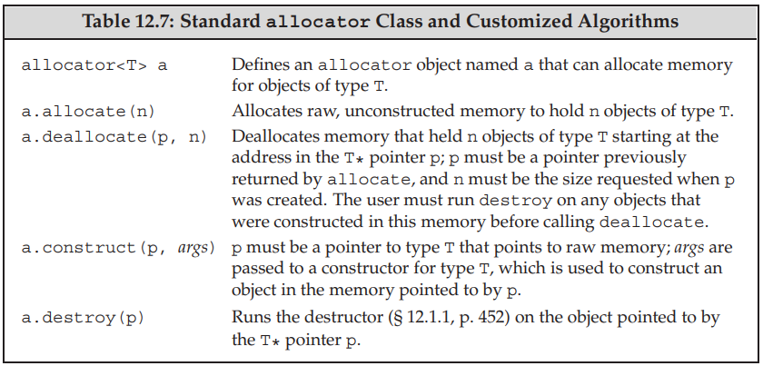
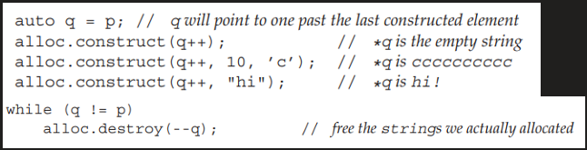
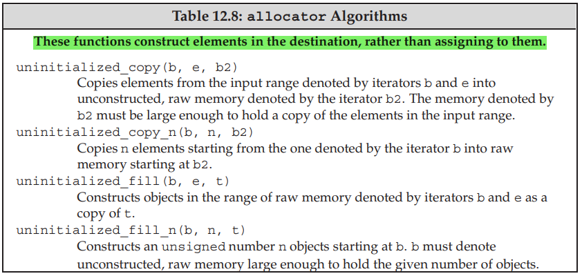
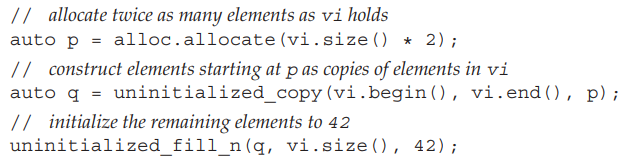

New and Delete
	1. Def: new /delete and new[]/delete[] is defined to let users to dynamically request to allocate heap memory.
		a. Note: All the expression and operator all defined in :: scope.
	2. Implementation: 
		a. new expression:    
			i. Ordinary expression:
				1) Call operator new() or operator new[] to allocates raw, unconstructed memory.
				2) call appriciate constructor to construct the object(s) from the specified initializers
				3) Eva to the appropaiate type and return the pointer.
			ii. Place new expression:
				1) Call appropriate placement new operator functions, then appropriate constructor to construct the objects with initializers.
				2) Eva to the appropaiate type and returns its second argument unchanged. 
		b. delete expression:
			i. The appropriate destructor is run on the object to which sp points or on the elements in the array to which arr points.
			ii. The compiler frees the memory by calling a library function named operator delete or operator delete[].
	3. operator functions
		a. Allocating version
			i. Def:
				
				void* operator new  ( std::size_t count );
				void* operator new;
				void  operator delete  ( void* ptr ) noexcept;
				void  operator delete noexcept;
				void* operator new  ( std::size_t count, const std::nothrow_t& tag );
				void* operator new;
				void  operator delete  ( void* ptr, const std::nothrow_t& tag ) noexcept;
				void  operator delete noexcept;
				
			
			ii. Properties:
				1) Global:All versions of operator new / delete (include placement new) are declared in the global namespace(::), not within the std namespace
				2) Implicit:The allocating/deallocating versions are implicitly declared in every translation unit of a C++ program, no matter whether header <new> is included or not.
				3) Replacement: The allocating versions are also replaceable, a program may provide its own definition that replaces the one provided by default to produce the result described above, or can overload it for specific type. (except for the form of placement new, placement delete)
				
		b. Placement version
			i. Def:
				
				void* operator new  ( std::size_t count, void* ptr );
				void* operator new;
				void  operator delete  ( void* ptr, void* place ) noexcept;
				void  operator delete noexcept;
				
			ii. Note
				1) The placement new operator is called by placement new expression or user manully.
				2) The placement delete is called by placement new when exception is throw, do nothing.
	4. Using
		a. Allocating new
            i. Initialization
                new type                   ** default-initialized.
                new type ()                ** value-initialized.
                new type (initializers)    ** direct-initialized.
                new type {}                ** list-initialized.
                new type [size]            ** default-initialized.
                new type [size] ()         ** value-initialized.
                new type [size] {initializer list }  ** aggregate-initialized.
            ii. typedef int arrT[3];
                int *p = new arrT;
                delete[] p
            iii. char *p = new char[0]
		b. Placement new
			new (place_address) type
			new (place_address) type (initializers)
			new (place_address) type [size]
			new (place_address) type [size] { braced initializer list }

    5. allocator Class
        1. The library allocator class, which is defined in the memory header, lets us separate allocation from construction.
        Defined in memory header.
            a. operations
               
            
            b. In the new library the construct member takes a pointer and zero or more additional arguments.
            c. eg
                
                
                
        
        2. Algorithms to Copy and Fill Uninitialized Memory, defined in memory header.
            a. Operations
                
                
            b. eg
               
    
